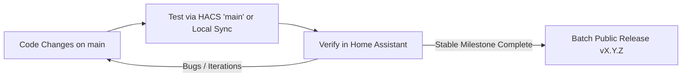

# Home Assistant Integration Development & Maintenance Guide

This document outlines the development lifecycle, testing strategies, release management, and architecture guidelines for building and maintaining public Home Assistant custom integrations (HACS-compliant).

---

## 1. Feature Classification: Public vs. Private

Before implementing any new capability, always determine the scope of the feature:

| Scope | Description | Implementation Strategy |
| :--- | :--- | :--- |
| **🌐 Public Feature** | Generic, camera/hardware agnostic features beneficial to all users of the integration (e.g. AI species parsing, standard sensor attributes, camera proxying, generic services, config flow improvements). | Implemented inside `custom_components/<domain>/`, committed to the public git repository, and documented in `README.md`. |
| **🔒 Private / Local Feature** | Specific to a single personal setup, custom Lovelace dashboard layouts, specific hardcoded stand names, local automations, private credentials, or custom scripts. | Stored in local project directories (e.g. `dashboards/`, `scripts/`), excluded from public releases, or configured via Home Assistant UI/YAML helpers. |

> [!IMPORTANT]
> **Agent Protocol**: When planning or proposing a new feature, always ask the user whether the feature is intended to be **Public** (for the shared HACS repository) or **Private / Local** (for their personal environment).

---

## 2. Iterative Development & Testing Lifecycle

To prevent release spam and maintain a clean public changelog, follow this standard development cycle:



### Step 1: Develop & Commit to `main`
- Make code changes directly on the `main` branch (or a dedicated feature branch).
- Commit frequently with clean conventional commit messages (e.g. `feat: ...`, `fix: ...`, `refactor: ...`).
- **Do not bump versions in `manifest.json` or create GitHub releases for intermediate test steps.**

### Step 2: Test in Home Assistant Without New Releases

Choose one of two fast-testing methods:

#### Option A: HACS `main` Tracking (Recommended)
1. Push changes to GitHub `origin main`.
2. Open **HACS** in Home Assistant &rarr; **Stealth Cam Command**.
3. Click `⋮` (top-right menu) &rarr; **Redownload**.
4. Select **`main`** from the version dropdown list.
5. Click **Download** and reload the integration / restart Home Assistant.

#### Option B: Direct Local File Sync (Instant, Zero Git Commits)
1. Copy or rsync modified files directly into `/config/custom_components/stealthcam_command/` on your Home Assistant machine.
2. In Home Assistant, go to **Developer Tools &rarr; YAML &rarr; Reload Custom Components** (or call `homeassistant.reload_config_entry`).
3. Changes take effect immediately within seconds.

---

## 3. Public Release Management (Milestones & Versioning)

Only publish a GitHub release when a group of related features and fixes has been tested and verified.

### Versioning Convention (Semantic Versioning)
- **Patch (`v1.2.1`)**: Backward-compatible bug fixes and small adjustments.
- **Minor (`v1.3.0`)**: New backward-compatible features, new sensors, or new services.
- **Major (`v2.0.0`)**: Breaking architectural changes, config flow rewrites, or API breaking changes.

### Release Checklist
1. **Update `manifest.json`**:
   Set `"version": "X.Y.Z"` to match the new release tag.
2. **Commit & Tag**:
   ```bash
   git add custom_components/
   git commit -m "release: vX.Y.Z - Summary of features"
   git tag vX.Y.Z
   git push origin main --tags
   ```
3. **Publish GitHub Release**:
   HACS requires a published **GitHub Release** (not just a raw git tag) to index the version:
   ```bash
   gh release create vX.Y.Z --title "vX.Y.Z: Release Title" --notes "### Changes in vX.Y.Z\n- Feature 1\n- Fix 2"
   ```

---

## 4. Architectural Best Practices for Home Assistant Integrations

1. **Native Camera Proxying**:
   - Never override `@property def entity_picture` with third-party external pre-signed URLs (e.g. AWS S3).
   - Let Home Assistant manage the proxy endpoint (`/api/camera_proxy/camera.<entity_id>?token=...`).
   - Implement `camera_image()` / `async_camera_image()` with an in-memory LRU cache to serve images instantly.

2. **Data Update Coordinator (`DataUpdateCoordinator`)**:
   - Group API requests into a single centralized coordinator update cycle.
   - Avoid having individual entities make independent network requests.
   - Default polling interval should be sensible (e.g. 300 seconds / 5 minutes for battery-conserving cloud services).

3. **Multi-Field Tag & Telemetry Parsing**:
   - Ingest data defensively: check direct boolean attributes, string values, and list/collection objects for species and telemetry.
   - Preserve local user overrides and merge them seamlessly during cloud refresh cycles.

4. **Standards & Hassfest Validation**:
   - Maintain `hacs.json`, `manifest.json`, and `.github/workflows/` compliant with standard Hassfest and HACS action validations.
   - Place all localized brand assets in `custom_components/<domain>/brand/` and root brand assets (`logo.png`, `icon.png`).
